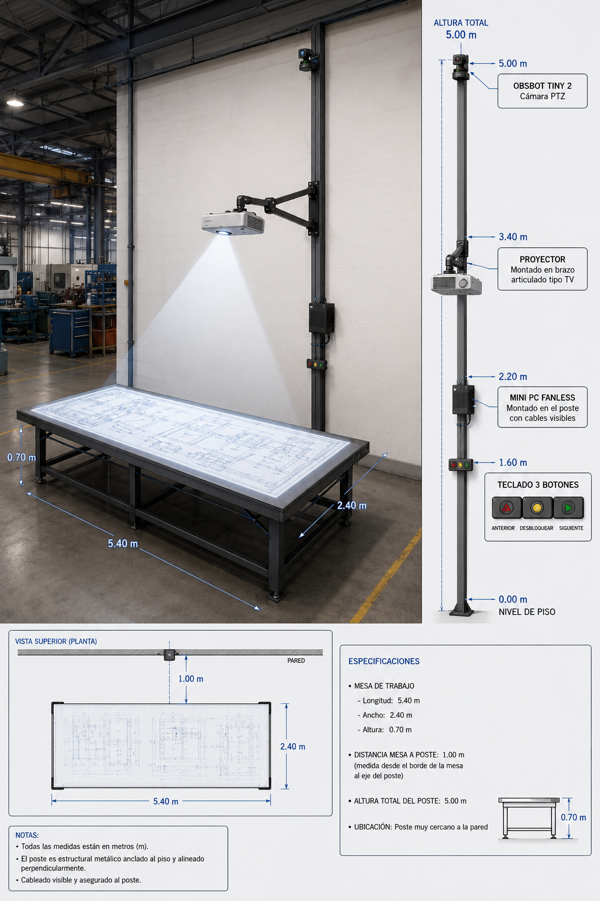
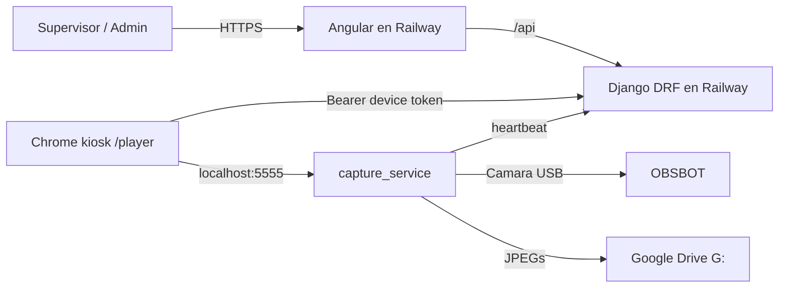

# 01. Distribucion y arquitectura

Este documento resume la arquitectura actual de produccion de la plataforma
Moden: dashboard web, backend API, player de proyeccion y mini-PCs en fabrica.

## 1. Vision general

La plataforma se usa para planificar y proyectar la fabricacion de modulos de
ferralla. El supervisor trabaja desde el dashboard web y cada mesa de fabrica
tiene un mini-PC con Chrome en modo kiosk apuntando al player.

Produccion:

- Frontend y player: `https://moden.up.railway.app`
- Backend: mismo dominio, bajo `/api/...`
- Servicio local por mini-PC: `http://127.0.0.1:5555`

## 2. Componentes

### Frontend Angular

Ruta principal de codigo: `app_proyeccion_moden`.

Incluye:

- Dashboard de cliente/ferralla.
- Admin operativo para Moden.
- Player de mesa en `/player`.
- Supervisor/visor tecnico en `/visor/:id`.
- Mapper/calibracion de proyector.

### Backend Django/DRF

Ruta principal de codigo: `api_proyeccion_moden`.

Responsabilidades:

- Usuarios/ferrallas/proyectos/modulos/mesas.
- Planificacion por grupos de mesas.
- Estado de colas y sincronizacion del indice proyectado.
- Emparejamiento de dispositivos.
- Fotos de fabricacion y validacion de colores.
- Estadisticas y lista de materiales.

### Capture service local

Ruta principal de codigo: `capture_service`.

Se instala en cada mini-PC en:

```text
C:\moden\capture_service
```

Responsabilidades:

- Abrir la camara OBSBOT.
- Exponer `/health`, `/stats`, `/capture` y `/device_token`.
- Guardar fotos en Google Drive.
- Persistir el token de dispositivo en `device_token.txt`.
- Reportar heartbeat al backend con estado de camara.

## 3. Mini-PCs de fabrica

Cada mesa fisica usa:

- Mini-PC Windows 11 Pro.
- Chrome kiosk.
- OBSBOT como camara.
- Google Drive Desktop montado como `G:`.
- Chrome Remote Desktop para soporte remoto.
- Tarea programada persistente `MODEN Player`: supervisa cada 30 segundos el
  servicio local y Chrome kiosk, usando un perfil tecnico aislado.

Convencion de nombres:

| Equipo Windows | `mesa_id` |
| --- | --- |
| `FER-G1-MESA1` | `fer_g1_mesa1` |
| `FER-G1-MESA2` | `fer_g1_mesa2` |
| `FER-G2-MESA1` | `fer_g2_mesa1` |

Ya no se usan nombres nuevos basados en roles fijos `INF` / `SUP`.

## 4. Distribucion fisica

Configuracion tipica por mesa:

- Proyector sobre mesa de trabajo.
- Mini-PC junto al proyector.
- Camara OBSBOT apuntando a la zona de fabricacion.
- Teclado/raton solo para puesta a punto o mantenimiento.
- Wi-Fi de fabrica.

Referencia visual actual:



## 5. Flujo de comunicacion



## 6. Operacion y soporte

- Instalacion de mini-PCs: `docs/04_minipc_setup.md`.
- Cheatsheet copy/paste: `capture_service/COMANDOS.txt`.
- Puesta en marcha en fabrica: `capture_service/PUESTA_EN_MARCHA_FABRICA.txt`.
- Branding del mini-PC: `capture_service/branding-wallpaper.jpg` y
  `capture_service/branding-user.jpg`.
