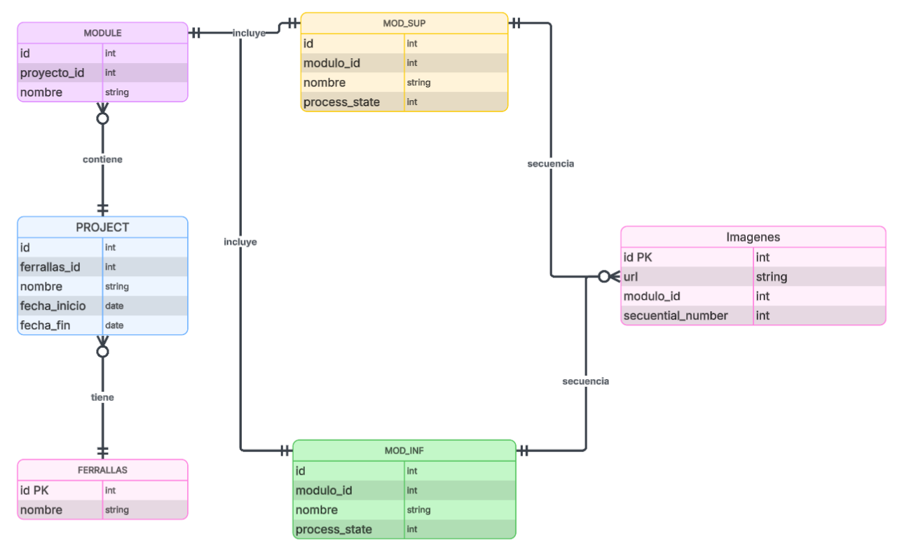
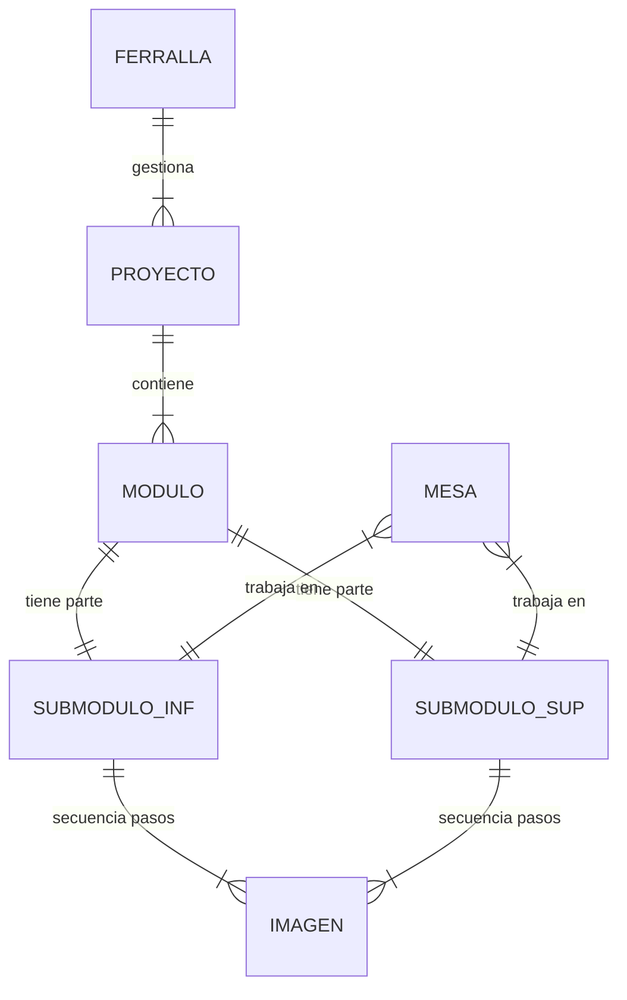

# 02. Elementos del Sistema (Entities)

## 1. Entidades Principales

### Ferrallas (Organization/Factory)
- Entidad de desarrollo principal (La Fábrica/Empresa).
- Puede gestionar múltiples **Proyectos**.
- Un usuario por ferralla.

### Proyecto (Project)
- Obra o encargo específico asignado a una Ferralla.
- Formado por un conjunto de **Módulos**.

### Módulos (Units)
- Unidad constructiva compleja.
- **Estructura fija**: Cada módulo se compone siempre de dos partes:
    1.  **Submódulo Inferior**.
    2.  **Submódulo Superior**.

### Submódulos (Sub-units)
- Componente físico real que se fabrica en la mesa.
- Contiene la **Secuencia de Imágenes** necesaria para su fabricación.

### Imágenes (Steps/Blueprints)
- Secuencia ordenada del proceso de fabricación (Paso 1, Paso 2, etc.).
- **Almacenamiento**: Se recomienda **NO** guardar la imagen como binario (BLOB) en la Base de Datos.
    - *Mejor práctica*: Guardar el archivo en un Storage Seguro (S3, MinIO, o carpeta protegida del servidor) y guardar en la BD solo la **Ruta/URL**.
    - Esto mantiene la BD ligera y facilita las copias de seguridad.

### Mesas (Workstations)
- Puesto físico de proyección.
- Se le asigna un **Submódulo** (o una imagen específica de la secuencia) para trabajar.

## 2. Diagrama de Entidad-Relación (ERD)

## 3. Diagrama de Distribución

