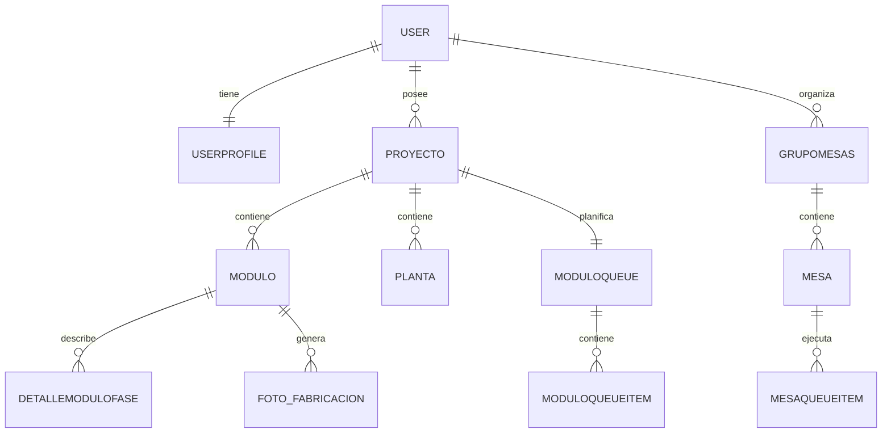

# 02. Elementos del sistema

Este documento describe las entidades principales del sistema y como se
relacionan en la operacion actual.

## 1. Ferralla / usuario

Una ferralla es el cliente/fabrica que entra al dashboard.

Datos relevantes:

- Usuario Django asociado.
- Perfil (`UserProfile`) con telefono, direccion, coordinador y capacidad
  diaria.
- Grupos de mesas.
- Proyectos asignados.

Nota operativa: Moden puede guardar una credencial visible de soporte en
`UserProfile.password_texto_plano`, accesible solo para staff/admin. La
password real de Django sigue guardandose como hash.

## 2. Proyecto

Un proyecto agrupa plantas, modulos, planos, datos tecnicos, fotos y estado de
fabricacion.

Campos/relaciones importantes:

- `usuario`: ferralla propietaria.
- `modulos`: unidades a fabricar.
- `grupos_bastidor`: agrupacion/orden de modulos.
- `capacidad_diaria_usuario`: lectura del perfil de ferralla.
- Estrategia de bastidor y longitud objetivo.

## 3. Modulo

Unidad fabricable. Cada modulo tiene dos fases logicas:

- `INFERIOR`
- `SUPERIOR`

El modulo puede tener:

- Tipo de modulo (`CENTRAL`, `CENTRAL_GIRADO`, `LADO_LARGO`, `LADO_CORTO`,
  `ESQUINA`).
- Codigo de colores (`codigos_color`) para la comprobacion automatica.
- Detalles de fase importados desde la fuente tecnica.
- Fotos de fabricacion.
- Estado de completado/cierre.

## 4. Mesas y grupos de mesas

Las mesas son puestos fisicos vinculados a un mini-PC. Se agrupan por ferralla
en `GrupoMesas`.

Actualmente una mesa no tiene un rol fijo permanente. Puede estar:

- Activa como inferior.
- Activa como superior.
- Inactiva temporalmente.

El dashboard permite cambiar ese estado y el backend replanifica preservando lo
que ya esta en curso.

## 5. Cola de fabricacion

La cola se representa con:

- `ModuloQueue`: cola por proyecto.
- `ModuloQueueItem`: plan del proyecto.
- `MesaQueueItem`: asignacion concreta a mesa.
- `MesaQueueStatus`: estado global por mesa.

El player y el supervisor sincronizan `current_image_index` con el backend para
que la mesa, el dashboard y el visor tecnico vean la misma posicion.

## 6. Imagenes y pasos

Las imagenes de proceso no se guardan como blobs en la base de datos. Se
almacenan como archivos y el backend conserva metadatos/rutas.

Convenciones relevantes en nombres de archivo:

- `_foto`: dispara captura de fabricacion.
- `_check`: dispara captura + comprobacion automatica de colores.
- `_visual` / `check visual`: paso de revision visual despues del check.

## 7. Fotos de fabricacion

`FotoFabricacion` guarda la foto capturada y metadatos:

- Proyecto/modulo/fase/paso.
- Mesa.
- Fecha de captura.
- Resultado de comprobacion automatica cuando aplica.
- Foto anotada si el detector genero diagnostico visual.

Las fotos se pueden revisar y descargar desde el dashboard.

## 8. Comprobacion de colores

El detector compara los colores esperados de `Modulo.codigos_color` con las
cartulinas/piezas detectadas en la foto de `_check`.

Estados del player:

| Estado | Asset runtime |
| --- | --- |
| Camara en espera/reintento | `app_proyeccion_moden/src/assets/check/check_waiting.jpg` |
| Camara no disponible | `app_proyeccion_moden/src/assets/check/check_no_camera.jpg` |
| Comprobacion correcta | `app_proyeccion_moden/src/assets/check/check_success.jpg` |
| Comprobacion fallida | `app_proyeccion_moden/src/assets/check/check_error.jpg` |

Estas imagenes son assets de la app, no documentacion. Si se actualizan
visualmente, deben reemplazarse en `app_proyeccion_moden/src/assets/check/`.

## 9. Diagrama ER simplificado

```mermaid
erDiagram
    USER ||--|| USERPROFILE : tiene
    USER ||--o{ PROYECTO : posee
    USER ||--o{ GRUPOMESAS : organiza
    GRUPOMESAS ||--o{ MESA : contiene
    PROYECTO ||--o{ PLANTA : contiene
    PROYECTO ||--o{ MODULO : contiene
    MODULO ||--o{ DETALLEMODULOFASE : describe
    MODULO ||--o{ FOTO_FABRICACION : genera
    MESA ||--o{ MESAQUEUEITEM : ejecuta
    PROYECTO ||--|| MODULOQUEUE : planifica
    MODULOQUEUE ||--o{ MODULOQUEUEITEM : contiene
```

