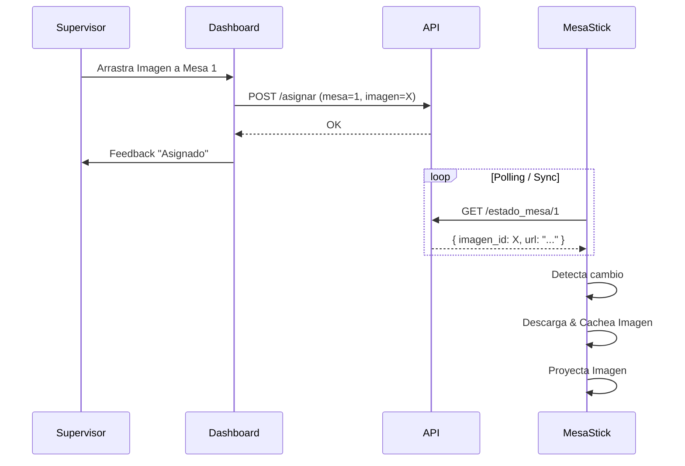

# 03. Páginas y Flujo de Usuario (Flow)

## 1. Mapa del Sitio (Sitemap)

### Público
- `/login`: Pantalla de acceso industrial.

### Privado (Supervisor - Dashboard)
- `/dashboard`: ("El Dispatcher")
    - Panel principal de asignación.
    - Columna Izquierda: Árbol de Proyectos/Módulos/Imágenes.
    - Columna Derecha: Tarjetas de Mesas (online/offline, ocupadas/libres).
    - Acción: Drag & Drop de izquierda a derecha.
- `/admin`: Panel de administración técnica (Django Admin).

### Privado (Mesa - Visor)
- `/visor/:id_mesa`:
    - Vista limpia, pantalla completa (negro por defecto si no hay imagen).
    - Muestra la imagen asignada.
    - Herramientas overlay (ocultas por defecto): Calibración (Mapper).

## 2. Flujo de Trabajo (Happy Path)

1.  **Inicio de Jornada**:
    - Las mesas (Sticks) se encienden y abren `/visor/:id`.
    - Muestran "Esperando asignación" o la última imagen cacheada.

2.  **Asignación**:
    - Supervisor entra a `/dashboard`.
    - Selecciona el Proyecto "Edificio A".
    - Busca el Módulo "Armadura 5".
    - Arrastra el plano "Armadura 5 - Vista Planta" sobre la tarjeta de "Mesa 1".

3.  **Proyección**:
    - Backend registra la asignación.
    - "Mesa 1" detecta el cambio (Polling/WS).
    - "Mesa 1" descarga la imagen segura y la renderiza.
    - El operario ve el plano sobre la superficie física y comienza a montar la ferralla.

## 3. Diagrama de Flujo

