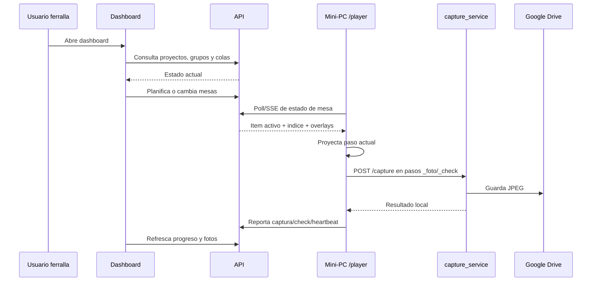

# 03. Paginas y flujo de usuario

Este documento resume las pantallas principales y los flujos actuales de uso.

## 1. Rutas principales

### Publicas

- `/login`: acceso de usuarios Moden/ferralla.
- `/player`: player de mini-PC. Usa token de dispositivo.

### Cliente / ferralla

- `/dashboard`: dashboard operativo de la ferralla.
- Vista de grupos/mesas, planificacion, progreso, estadisticas, lista de
  materiales y fotos.

### Admin Moden

- `/admin-dashboard/ferrallas`: alta y mantenimiento de ferrallas, grupos de
  mesas, vincular/desvincular mini-PCs y credenciales de soporte.
- `/admin-dashboard/proyectos`: gestion de proyectos.
- `/admin-dashboard/proyectos/:id`: detalle tecnico del proyecto, importacion,
  bastidores, fotos, configuracion y nombre editable.

### Supervisor / tecnico

- `/visor/:id`: visor tecnico de una mesa concreta con auth de usuario. Se usa
  para calibracion, supervision y pruebas sin token de dispositivo.

## 2. Puesta en marcha de una mesa

1. El mini-PC inicia sesion como `moden`.
2. La tarea programada `MODEN Player` lanza `start-player.bat`.
3. `start-player.bat` arranca `capture_service.py` y Chrome kiosk.
4. Chrome abre `https://moden.up.railway.app/player`.
5. El player recupera su token desde `localStorage` o desde
   `capture_service` (`/device_token`).
6. Si no hay token, muestra codigo de vinculacion.
7. Moden vincula el codigo desde admin.
8. A partir de ahi el player usa token de dispositivo y no necesita login.

## 3. Flujo diario de fabricacion


```mermaid
sequenceDiagram
    participant Ferralla as Usuario ferralla
    participant Dashboard
    participant API
    participant Player as Mini-PC /player
    participant Capture as capture_service
    participant Drive as Google Drive

    Ferralla->>Dashboard: Abre dashboard
    Dashboard->>API: Consulta proyectos, grupos y colas
    API-->>Dashboard: Estado actual
    Dashboard->>API: Planifica o cambia mesas
    Player->>API: Poll/SSE de estado de mesa
    API-->>Player: Item activo + indice + overlays
    Player->>Player: Proyecta paso actual
    Player->>Capture: POST /capture en pasos _foto/_check
    Capture->>Drive: Guarda JPEG
    Capture-->>Player: Resultado local
    Player->>API: Reporta captura/check/heartbeat
    Dashboard->>API: Refresca progreso y fotos
```

## 4. Navegacion del player

Atajos actuales:

| Tecla | Accion |
| --- | --- |
| `C` | Entrar/salir de calibracion |
| `G` | Calibracion con grid alternativa |
| `B` | Mostrar/quitar fondo de cobertura del proyector |
| `R` | Recarga fuerte de la app (limpia caches/SW y cambia querystring) |
| `ArrowRight` | Siguiente paso |
| `ArrowLeft` | Paso anterior |
| `Space` | Reconocer check fallido/no camara y avanzar a revision visual |

En modo player hay bloqueo de 5 segundos al avanzar para evitar saltos
accidentales. En modo supervisor (`/visor/:id`) ese bloqueo no aplica.

## 5. Flujo de comprobacion automatica de colores

Los pasos con `_check` en el nombre disparan una captura especial:

1. El player espera a que el plano `_check` este proyectado.
2. Llama a `capture_service` para hacer la foto.
3. El backend ejecuta la deteccion de colores contra `Modulo.codigos_color`.
4. El backend guarda el estado `check_overlay` en la mesa.
5. El player y el supervisor muestran el estado correspondiente.

Estados visuales del player:

| Estado backend/local | Imagen proyectada |
| --- | --- |
| Reintentando camara | `assets/check/check_waiting.jpg` |
| Sin camara | `assets/check/check_no_camera.jpg` |
| Check correcto | `assets/check/check_success.jpg` |
| Check fallido | `assets/check/check_error.jpg` |

Estas imagenes viven en:

```text
app_proyeccion_moden/src/assets/check/
```

No deben duplicarse en `docs/`; si se quiere cambiar el aspecto en produccion,
se reemplazan los assets de esa carpeta y se despliega el frontend.

## 6. Flujo de fotos

- `_foto`: captura normal de fabricacion.
- `_check`: captura con validacion automatica.
- Las fotos se guardan en Google Drive y se registran en backend.
- El dashboard permite revisar fotos por modulo y descargar ZIP por modulo o
  por proyecto.

## 7. Flujo de soporte remoto

1. Conectar por Chrome Remote Desktop.
2. Si hay que usar OBSBOT, cerrar Chrome kiosk y matar `python/pythonw`.
3. Ajustar camara en OBSBOT Center.
4. Cerrar OBSBOT completamente.
5. Relanzar `C:\moden\capture_service\start-player.bat` o reiniciar.

La guia copy/paste para una persona no tecnica esta en:

```text
capture_service/PUESTA_EN_MARCHA_FABRICA.txt
```

