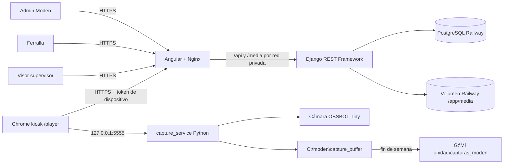

# Traspaso del proyecto Moden

Estado verificado: **20 de agosto de 2026**  
Repositorio: `LeyanisModen/Projection_Platform`  
Commit funcional de referencia: `b297565` (`feat: permitir scroll en colas de mesas`)  
Rama de trabajo recomendada: `develop`  
Producción: `deploy`

Este documento es la fuente de entrada para continuar el proyecto sin tener que
leer la conversación histórica. Describe el sistema que existe hoy, no solo la
idea inicial.

> Importante: `docs/05_architecture_and_security.md` conserva una propuesta
> histórica de servidor local y SQLite. No representa la arquitectura actual de
> producción. Las fuentes de verdad actuales son el código, este documento,
> `docs/01_distribution.md`, `docs/02_elements.md`, `docs/03_pages_and_flow.md`
> y los runbooks de `capture_service/`.

## Resumen de estado

| Elemento | Estado verificado |
| --- | --- |
| Código funcional en `develop` | `b297565`; el commit documental de este traspaso no cambia la app |
| Rama `deploy` | `b297565`, sincronizada con `origin/deploy` |
| Railway staging | Frontend, backend y PostgreSQL en `SUCCESS` |
| Railway producción | Frontend, backend y PostgreSQL en `SUCCESS` |
| Pruebas backend | 106 correctas |
| Pruebas frontend | 30 correctas |
| Pruebas capture service | 30 correctas |
| Build Angular producción | Correcto, con dos warnings de presupuesto |
| Versión capture service | `2026-08-14.1` |
| Worktree al iniciar este traspaso | Limpio salvo `temp/`, local y no versionado |

## 1. Objetivo general del proyecto

La plataforma Moden coordina la fabricación de módulos de ferralla mediante
proyección guiada sobre mesas físicas. Su objetivo es convertir las secuencias
de imágenes técnicas de cada módulo en un flujo de producción ordenado,
trazable y supervisable.

El sistema debe permitir que:

- Moden cree proyectos, importe módulos, datos técnicos, planos y planillas.
- Los proyectos se dividan en bastidores y se distribuyan entre mesas de
  fabricación inferiores y superiores.
- Cada mini-PC proyecte la secuencia correcta a tamaño y perspectiva calibrados.
- El operario avance con una botonera sin tener que usar el dashboard.
- Un supervisor vea y controle en paralelo lo mismo que proyecta el player.
- Se capturen evidencias, se comprueben cintas de colores y se documenten las
  jornadas de producción.
- La ferralla consulte progreso, estadísticas, materiales, fotos y documentos.
- Los reinicios, módulos añadidos y cambios de planificación se incorporen sin
  borrar el proyecto ni perder el trabajo ya iniciado.

## 2. Problema que resuelve la aplicación

La fabricación tiene dos fases físicas por módulo, `INFERIOR` y `SUPERIOR`, que
se ejecutan en mesas distintas pero deben mantenerse coordinadas. Antes de esta
plataforma, el orden, las imágenes, el seguimiento y las incidencias dependían
de operaciones manuales y conocimiento informal.

Los problemas principales que resuelve son:

| Problema | Solución implementada |
| --- | --- |
| Proyectar el plano correcto en cada paso | Player kiosk con secuencia ordenada por módulo/fase |
| Coordinar varias mesas | Planner y colas `MesaQueueItem` |
| Mantener supervisor y player sincronizados | Índice actual y estado compartidos por API/SSE |
| Evitar perder emparejamientos al reiniciar | Token persistido en navegador y en disco local |
| Rehacer una fase o módulo | Reinicio por fase o completo, con sufijo `-R` |
| Añadir módulos durante producción | Reconciliación automática de colas |
| Preservar trabajo ya empezado al reordenar | Anclas de cola y bloqueo desde la imagen real 3 |
| Saber qué se fabricó y cuándo | Estados, `completado_at`, fotos y estadísticas |
| Comprobar cintas de colores | Captura `_check` y detector OpenCV |
| Documentar toda la jornada sin saturar Internet | Búfer local y sincronización de fin de semana |
| Evitar que Google Drive tape la proyección | Drive cerrado durante producción mediante guard |
| Gestionar equipos remotos inestables | Watchdog, perfil Chrome aislado y actualización GitHub |

## 3. Arquitectura y tecnologías utilizadas

### 3.1 Diagrama general



### 3.2 Frontend web

- Angular `21.0.5`.
- TypeScript `~5.9.2`.
- RxJS `7.8`.
- Angular CDK para drag and drop.
- Vitest a través de `ng test`.
- Nginx Alpine en producción.
- La app usa rutas relativas `/api` y `/media`; Nginx las reenvía al backend.
- `index.html` y las rutas SPA llevan `no-store`; assets versionados pueden
  cachearse un año.
- El frontend no conoce directamente la URL pública del backend.

Rutas principales:

| Ruta | Uso |
| --- | --- |
| `/` | Login |
| `/dashboard` | Dashboard de ferralla/cliente |
| `/player` | Player kiosk de mini-PC |
| `/visor/:id` | Visor técnico/supervisor |
| `/mapper` | Calibración/mapeo |
| `/admin-dashboard/ferrallas` | Gestión Moden de ferrallas y mesas |
| `/admin-dashboard/proyectos` | Gestión Moden de proyectos |
| `/admin-dashboard/proyectos/:id` | Detalle, importación, bastidores y previews |

### 3.3 Backend

- Python `3.11` en el contenedor Railway.
- Django `5.2.10`.
- Django REST Framework `3.16.1`.
- PostgreSQL en Railway; SQLite solo como fallback local.
- Gunicorn `24.1.1`, dos workers y cuatro threads por defecto.
- Pillow, OpenCV headless y NumPy para imágenes y detección.
- Autenticación de usuarios con `TokenAuthentication` de DRF.
- Autenticación separada de dispositivos con token de mesa hasheado.
- Archivos en volumen persistente Railway montado en `/app/media`.
- Migraciones automáticas con `python manage.py migrate --noinput` en
  `preDeployCommand`.

Routers/API principales:

- `users`, `proyectos`, `modulos`, `imagenes`, `mesas`, `grupos-mesas`.
- `detalle-modulo-fases`, colas de proyecto y de mesa.
- `device` para pairing, heartbeat, estado, índice, configuración y fotos.
- `fotos` para consulta y ZIP.
- `grupos-bastidor` para mover y ordenar módulos/bastidores.
- `/api/stats/production/`.
- `/api/lista-materiales/general/`.

### 3.4 Servicio local de los mini-PCs

- Python + OpenCV en Windows.
- Servicio HTTP solo en `127.0.0.1:5555`.
- Cámara OBSBOT Tiny por USB.
- Chrome en modo kiosk con perfil aislado.
- PowerShell para instalación, actualización y watchdog.
- Google Drive Desktop para archivo documental diferido.

Endpoints locales:

| Endpoint | Función |
| --- | --- |
| `GET /health` | Verificar que el servicio vive |
| `GET /stats` | Cámara, disco, captura, sincronización y configuración |
| `POST /capture` | Foto requerida por `_foto` o `_check` |
| `POST /save_debug_image` | Persistir diagnóstico anotado |
| `GET/POST /device_token` | Recuperar/persistir pairing |
| `POST /close_browser` | Cerrar kiosk con pausa de mantenimiento |

### 3.5 Herramienta de perspectiva y timelapse

- Aplicación de escritorio independiente.
- PySide6, OpenCV, NumPy e `imageio-ffmpeg`.
- Corrige perspectiva en lote y crea vídeos MP4.
- Puede dibujar la hora de captura sobre cada frame.
- No depende de Django ni de Angular.

### 3.6 Entornos Railway

Estado consultado con Railway CLI el 20/08/2026:

| Entorno | Rama | Frontend | Backend | Base de datos |
| --- | --- | --- | --- | --- |
| staging | `develop` | `calm-curiosity-staging.up.railway.app` | `projectionplatform-staging.up.railway.app` | PostgreSQL staging |
| production | `deploy` | `moden.up.railway.app` | `projectionplatform-production.up.railway.app` | PostgreSQL producción |

Los seis servicios estaban en `SUCCESS` y frontend/backend ejecutaban
`b297565`.

Volúmenes observados:

| Entorno | PostgreSQL | Media |
| --- | ---: | ---: |
| staging | ~185 MB de 5 GB | ~390 MB de 5 GB |
| production | ~131 MB de 500 MB | ~2.368 GB de 5 GB |

El frontend usa el backend por red privada mediante `BACKEND_ORIGIN`,
`BACKEND_HOST` y el resolver interno. Esto redujo egress y eliminó el contenido
mixto HTTPS/HTTP.

Railway está actualmente en plan **Pro**, contratado durante el incidente de
colas de despliegue. El análisis de coste anterior mostró que el egress era el
componente dominante; por eso se movió el proxy frontend-backend a red privada.
Hay que comparar al menos un ciclo mensual completo antes de valorar otro plan
u otro proveedor.

Staging se creó con una copia funcional de usuarios, proyectos, grupos y mesas,
incluido un usuario de ferralla de prueba, pero sin las fotos históricas. Las
credenciales no se documentan aquí y deben obtenerse por el canal interno. Como
estos datos pueden evolucionar, comprobar el contenido de staging antes de usar
un proyecto concreto como fixture manual.

## 4. Estructura de carpetas y archivos principales

```text
proyection_platform/
|-- app_proyeccion_moden/          Angular, player, visor y dashboards
|-- api_proyeccion_moden/          Django/DRF, modelos, planner y media
|-- capture_service/               Servicio e instalación de mini-PCs
|-- admin_tools/perspective_tool/  Corrección de perspectiva y timelapse
|-- docs/                          Documentación funcional y técnica
|-- scripts/                       Utilidades de seed y pendrive
|-- docker-compose.yml             Stack local PostgreSQL/backend/frontend
|-- implementation-tasks.md        Notas históricas; no es backlog fiable
|-- temp/                          Datos locales de trabajo; no versionar
```

### 4.1 Frontend

| Archivo/carpeta | Responsabilidad |
| --- | --- |
| `src/app/app.routes.ts` | Rutas públicas, dashboard, player, visor y mapper |
| `src/app/services/api.service.ts` | Interfaces y cliente HTTP central |
| `src/app/services/lista-materiales.service.ts` | Estado/API de compra |
| `src/app/services/user-title.strategy.ts` | Título de pestaña con usuario |
| `src/app/dashboard/` | Dashboard cliente, polling, mesas, estadísticas y proyectos |
| `src/app/visor/` | Player/visor, teclado, overlays, fotos, checks y pairing |
| `src/app/mapper/` | Calibración y transformación de proyección |
| `src/app/admin/ferrallas/` | Usuarios, grupos, mesas, pairing y captura remota |
| `src/app/admin/proyectos/` | Lista y creación de proyectos |
| `src/app/admin/proyectos/detalle/` | Importación, bastidores, fases y previews |
| `project-table-preview.component.*` | Simulación de mesas y reordenación teórica |
| `module-import.utils.ts` | Selección múltiple y validación previa de MOD-* |
| `phase-action.utils.ts` | Decide completar o reiniciar una fase |
| `src/app/shared/zoomable-image/` | Zoom/pan reutilizable para fotos |
| `src/assets/check/` | Estados visuales del check de colores |
| `nginx.conf` | SPA, caché y proxy privado `/api`/`/media` |
| `Dockerfile` | Build Node y runtime Nginx |

### 4.2 Backend

| Archivo/carpeta | Responsabilidad |
| --- | --- |
| `api/models.py` | Modelo de datos y cálculos de dominio |
| `api/serializers.py` | Serialización y estado operativo derivado |
| `api/views.py` | Endpoints, importación, planner, fotos, stats y materiales |
| `api/queue_sync.py` | Reconciliación, reubicación y anclas de colas |
| `api/module_features.py` | Detección de módulos con `SD_S`/`SD_D` |
| `api/project_media.py` | Borrado seguro de media sin referencias |
| `api/color_detection.py` | Detector OpenCV de cintas de colores |
| `api/tests.py` | Suite principal de permisos, importación, colas y planner |
| `api/test_color_detection.py` | Pruebas del detector de colores |
| `api/migrations/` | Migraciones `0001` a `0050_remove_planta` |
| `api/management/commands/` | Reconciliar, sincronizar, resetear y simular |
| `proyeccion_moden/settings.py` | DB, auth, CORS, media y límites de subida |
| `proyeccion_moden/urls.py` | Router REST y endpoints agregados |
| `railway.json` | Migración predeploy y arranque Gunicorn |

`api/views.py` y `api/models.py` son grandes y concentran mucha lógica. Antes
de modificar planificación o importación hay que buscar pruebas existentes y
añadir una regresión para el caso nuevo.

### 4.3 Capture service

| Archivo | Responsabilidad |
| --- | --- |
| `capture_service.py` | Cámara, HTTP, documentación, Drive y config remota |
| `config.ini.example` | Valores por defecto/documentados |
| `install-minipc.ps1` | Instalación idempotente completa |
| `recover-minipc.ps1` | Recuperación desde GitHub preservando identidad |
| `repair-config.ps1` | Reparación de `config.ini` dañado |
| `update-capture-service.ps1` | Actualizador automático desde `deploy` |
| `player-watchdog.ps1` | Recupera servicio, kiosk y foco |
| `start-player.bat` | Arranque compatible/legado |
| `test_sharpness.py` | 30 pruebas de cámara, horarios, Drive y almacenamiento |
| `README.md` | Operación del servicio |
| `SETUP_MINIPC.md` | Instalación completa del equipo |
| `PUESTA_EN_MARCHA_FABRICA.txt` | Bloques listos para copiar/pegar en fábrica |
| `COMANDOS.txt` | Diagnóstico y rescate |
| `VERSION` | Versión que consumen los actualizadores |

### 4.4 Datos y documentación local

- `docs/Valdebebas_B5_P7_resumen_modulos.db` es una muestra local de la base
  técnica de entrada; está ignorada por Git.
- `docs/usuarios_activos.txt` contiene información sensible local, está
  ignorado por Git y no debe incorporarse a commits ni al traspaso.
- `temp/` contiene archivos de trabajo personales y está sin versionar.
- No usar el `db.sqlite3` local como representación de producción.

## 5. Funcionalidades ya implementadas

### 5.1 Administración de ferrallas

- Alta/edición de usuarios ferralla.
- Credencial de soporte visible solo para Moden.
- Contactos y direcciones.
- Grupos de mesas y mesas dinámicas `INFERIOR`, `SUPERIOR` o inactivas.
- Mesas listadas por nombre.
- Pairing, unbind y estado de conexión.
- Acceso directo al player/visor desde el detalle.
- Configuración de jornada, días, intervalo y rotación por cámara.
- Revisión de qué mesas han aplicado cada revisión de configuración.

### 5.2 Proyectos e importación

- Creación de proyecto con importación estructural tolerante.
- Un módulo inválido no impide importar los válidos; se informa cuál falló.
- Selección múltiple de carpetas `MOD-*` desde una carpeta común.
- Detección de duplicados sobre todas las páginas de la API.
- Separación correcta de carpetas `INF`, `SUP`, `SD_S` y `SD_D`.
- `SD_S` y `SD_D` se agregan hoy a la secuencia `SUPERIOR`.
- Importación y actualización de base técnica SQLite.
- Reaplicación automática de datos técnicos a módulos añadidos después.
- PDF de plano y PDF de planilla detectados por nombre.
- Previsualizador de imágenes sin alterar fabricación.
- Previsualizador de mesas virtuales.
- Reordenación desde mesas virtuales inferiores; superior solo lectura.
- Checkbox para ocultar bastidores completamente terminados.
- Nombre de proyecto editable con foco automático.
- Eliminación de módulos con confirmación y limpieza de media.
- Empaquetado de nuevos módulos en bastidores, no uno por bastidor.
- Proyectos sin entidad `Planta`; cada planta es un proyecto independiente.

### 5.3 Bastidores, planificación y colas

- Bastidores secuenciales con orden persistido.
- Módulos ordenados dentro de cada bastidor mediante `orden_intra`.
- Movimiento entre bastidores y reordenación de bastidores.
- Un bastidor queda asociado a una única mesa inferior.
- Las colas superiores se derivan del avance previsto de las inferiores.
- Reconciliación automática al añadir, mover, borrar o reiniciar módulos.
- Preservación de trabajo ya empezado mediante prefijos/anclas.
- Reubicación de fases al cambiar tipos/activación de mesas.
- Recuperación de fases superiores omitidas tras redistribuciones.
- Reordenación de pendientes alrededor de módulos empezados sin mover anclas.
- Proyectos añadidos o módulos nuevos aparecen sin quitar/reagregar el proyecto.
- Scroll interno en las colas del dashboard sin aumentar el alto de las tarjetas.

### 5.4 Estados y reinicios

- Completar módulo completo.
- Completar fase individual.
- Reiniciar módulo completo.
- Reiniciar fase individual aunque esté en curso.
- Reinicio `SUPERIOR` incluye sus imágenes SD.
- Módulos rehechos usan sufijo `-R`.
- Los módulos bloqueados se ven grises y con candado.
- Los módulos con SD se destacan con color propio.
- Estado operativo derivado para mostrar producción real sin falsear estadísticas.

### 5.5 Player y visor

- Player y visor son entidades paralelas sobre el mismo estado.
- Player autenticado por token persistente; visor por usuario.
- Pairing recuperable desde `localStorage` o `device_token.txt`.
- Avance/anterior y sincronización de índice.
- Bloqueo de cinco segundos solo en el player, con indicador de puntos.
- Visor supervisor sin bloqueo de autoridad.
- Captura automática `_foto` y autoavance después de éxito.
- Flujo `_check` con espera, detección y overlays compartidos.
- Aviso persistente si no hay cámara y opción de continuar.
- Animación repetida cuando el nombre contiene `warning`.
- Calibración y distorsión de proyección.
- Overlays de teclas compactos, transparentes y centrados.
- Recuperación automática del foco del kiosk.
- Doble `Q` para cerrar kiosk y entrar en pausa de mantenimiento.

Atajos actuales:

| Tecla | Acción |
| --- | --- |
| `C` | Entrar/salir de calibración |
| `G` | Grid alternativa de calibración |
| `B` | Fondo de cobertura |
| `V` | Cama de 15 |
| `W` | Cama de 20 |
| `R` | Recarga fuerte manual, sin overlay para cliente |
| `ArrowRight` | Siguiente imagen |
| `ArrowLeft` | Imagen anterior |
| `Space` | Reconocer fallo/no cámara y continuar el flujo de check |
| `Q`, `Q` | Cerrar kiosk con pausa de mantenimiento |

### 5.6 Cámara, fotos y documentación

- Captura requerida en FullHD con JPEG 95.
- Espera entre 1,5 y 3 segundos hasta estabilizar luminosidad.
- Ventana de cuatro muestras y tolerancia del 3 %.
- Rotación configurable `0/90/180/270`; fábrica usa normalmente 180.
- Foto de fabricación registrada por módulo, fase y paso.
- Fotos de módulo/proyecto consultables y descargables como ZIP.
- Visor de fotos al ~90 % con zoom y paneo.
- Captura documental FullHD JPEG 88 cada 20 segundos por defecto.
- Horario remoto por ferralla; defaults lunes-viernes 06:50-15:00.
- Consulta de configuración remota al arrancar y a las 06/09/12/15.
- Reintento temporal cada 10 minutos si falla la conexión.
- Búfer local, límite de 30 GB y reserva mínima de 5 GB.
- Retención local de siete días solo si Drive tiene ruta y tamaño equivalentes.
- Sincronización viernes 15:30 a lunes 05:00.
- Drive abierto viernes 15:15 a lunes 06:35 y cerrado durante producción.
- Detección diaria de nitidez/lente con umbrales conservadores.
- Watchdog restaura cámara/kiosk y recupera foco.
- Actualización automática desde la rama `deploy` a las 04:15.

### 5.7 Detección de cintas

- Detector HSV/OpenCV por colores esperados en `Modulo.codigos_color`.
- Área mínima escalada: 1200 px² sobre referencia 4K.
- Densidad mínima de bounding box: 60 %.
- Solidez mínima: 0,65.
- Relación de aspecto aceptada: 0,2 a 5,0.
- Se ignora el 22 % superior de la foto, fuera de la mesa útil.
- Genera diagnóstico anotado para análisis.

### 5.8 Dashboard cliente

- Cabecera con anclas a grupos, estadísticas y proyectos.
- Tarjetas de mesa con módulo, imagen actual/total y estado de conexión.
- Scroll de cola manteniendo tarjetas de altura fija.
- Cliente sin permisos de drag/drop sobre colas reales.
- Tarjetas de proyecto con módulos, compra, plano, planilla y donut.
- Modal de módulos ordenable por nombre o actividad/fecha.
- En orden temporal: módulos en proceso primero y completados más recientes después.
- Fecha/hora de finalización por módulo.
- Lista de materiales por proyecto y general.
- Estadísticas por rango, mesa, día y hora real.
- KPIs de módulos/hora y kg/hora.
- Título de pestaña con el usuario conectado.

### 5.9 Herramienta de perspectiva/timelapse

- Selección de cuatro esquinas y guardado JSON.
- Transformación en lote idempotente.
- Filtro de fechas/horas.
- MP4 por FFmpeg con fallback OpenCV.
- Hora opcional superpuesta en el vídeo.
- Empaquetado opcional con PyInstaller.

## 6. Decisiones técnicas y justificación

### 6.1 Dos ramas y dos entornos

`develop` despliega staging y `deploy` despliega producción. Todo cambio debe
probarse en staging antes de fusionarse a `deploy`. Esto se creó porque fábrica
ya está produciendo y no puede recibir cambios parciales.

### 6.2 Frontend y backend por red privada

El navegador solo habla con `moden.up.railway.app`. Nginx reenvía `/api` y
`/media` al backend. Evita contenido mixto, simplifica CORS y reduce egress
interno facturable.

### 6.3 Migraciones automáticas

Railway ejecuta migraciones antes de arrancar el backend. Antes era necesario
hacerlas manualmente y esto provocó versiones de código/esquema desalineadas.

### 6.4 Token de dispositivo persistido en dos lugares

El pairing no puede perderse al reiniciar. Se guarda en navegador y en
`C:\moden\capture_service\device_token.txt`. Solo una desvinculación explícita
desde admin debe invalidarlo.

### 6.5 Estado operativo derivado

Mostrar una imagen avanzada significa que físicamente ya se trabaja en el
módulo, pero no debe marcar una fase como terminada. Por ello se expone
`estado_operativo` sin modificar el estado persistido ni las estadísticas.

### 6.6 Dos imágenes iniciales todavía movibles

Los índices 0 y 1 son preparación. A partir del índice 2, mostrado como imagen
3, la posición física se considera comprometida y el módulo queda bloqueado.

### 6.7 Las mesas inferiores gobiernan el bastidor

Un bastidor físico se llena desde una sola mesa inferior. La cola superior se
deriva/intercala siguiendo las secuencias inferiores. Reordenar directamente la
superior no tendría correspondencia física y se prohíbe.

### 6.8 SD integrado temporalmente en SUPERIOR

`SD_S` y `SD_D` son extensores fabricados en superiores. Cada carpeta tiene su
secuencia completa, pero hoy forman una única fase superior junto a `SUP`. Esto
garantiza que se proyecten todos los pasos con un modelo de datos simple. La
contrapartida es que todavía no pueden completarse o reiniciarse por separado.

### 6.9 Búfer local y Drive de fin de semana

El Internet de fábrica es limitado y los popups de Drive llegaron a tapar el
kiosk. Las capturas documentales se guardan localmente durante la semana y se
publican el fin de semana. Nunca se borra una copia única.

### 6.10 Configuración remota pocas veces al día

Horario, intervalo y rotación cambian raramente. Consultar a las 06/09/12/15
reduce tráfico y carga, pero permite cambios de última hora. Se puede forzar una
consulta/reinicio manual desde los runbooks.

### 6.11 Sin recarga automática agresiva del navegador

Se probó una recarga sin caché automática y provocó pairing/sesiones expiradas.
Se retiró. El capture service sí se actualiza automáticamente; el frontend usa
`R` para recarga fuerte cuando realmente hace falta.

### 6.12 Archivos fuera de la base de datos

Las imágenes no son BLOBs. Django conserva rutas y metadatos; Railway guarda
media en volumen. Facilita ZIP, diagnóstico y limpieza, aunque obliga a vigilar
huérfanos y capacidad del volumen.

### 6.13 Password de soporte visible

La contraseña real de Django sigue hasheada. Se conserva además
`password_texto_plano` por decisión operativa para que Moden pueda prestar
soporte. Solo se muestra a staff. Es una concesión de seguridad consciente que
debe revisarse si aumenta el número de administradores.

## 7. Modelo de datos, variables y cálculos

### 7.1 Enumeraciones principales

| Enumeración | Valores |
| --- | --- |
| `Fase` | `INFERIOR`, `SUPERIOR` |
| `MesaTipo` | `INFERIOR`, `SUPERIOR` |
| `MesaQueueStatus` | `EN_COLA`, `MOSTRANDO`, `HECHO` |
| `ModuloEstado` | `PENDIENTE`, `EN_PROGRESO`, `COMPLETADO`, `CERRADO` |
| `TipoModulo` | `CENTRAL`, `CENTRAL_GIRADO`, `LADO_LARGO`, `LADO_CORTO`, `ESQUINA` |
| `EstrategiaBastidor` | `SECUENCIAL`, `AISLAR_CENTRAL_GIRADO` |
| `MaterialTipo` | refuerzo, barra solape, zuncho, separador, punzo |

### 7.2 Entidades

| Entidad | Datos/relaciones esenciales |
| --- | --- |
| `Proyecto` | usuario, nombre, longitud bastidor 114 cm, estrategia, PDFs y DB técnica |
| `GrupoBastidor` | proyecto, índice, nombre y grupo de mesas reservado |
| `Modulo` | proyecto, bastidor, orden, tipo, ancho, colores, estados y cierre |
| `DetalleModuloFase` | pesos, cortes, piezas, metros, dificultad y observaciones por fase |
| `Imagen` | módulo, fase, orden, versión, estado, URL/archivo y checksum |
| `FotoFabricacion` | módulo, mesa, fase, paso, timestamps, archivo y resultado check |
| `GrupoMesas` | ferralla, proyectos en cola y mesas físicas |
| `GrupoMesasProyecto` | orden de proyectos dentro del grupo |
| `Mesa` | tipo, índice, activa, pairing, índice, cámara, rotación y calibración |
| `ModuloQueueItem` | orden teórico dentro de proyecto |
| `MesaQueueItem` | asignación concreta módulo/fase/mesa/posición/estado |
| `MaterialPieza` | pieza técnica individual por módulo/proyecto/fase |
| `MaterialInformado` | checkbox por proyecto y clave con origen manual/general |

Restricciones importantes:

- Un único detalle por `modulo + fase`.
- Una única imagen por `modulo + fase + orden + versión`.
- Una única foto por `modulo + fase + paso`.
- Una única asignación activa por `modulo + fase`; históricos `HECHO` sí pueden
  coexistir.
- Una única marca de material por `proyecto + clave_material`.

### 7.3 Estado de módulo

Estado persistido:

```text
inferior_hecho=false, superior_hecho=false -> PENDIENTE
exactamente una fase hecha                 -> EN_PROGRESO
ambas fases hechas                         -> COMPLETADO + completado_at
cerrado=true                               -> CERRADO
```

Estado operativo visible:

```text
cerrado                                    -> CERRADO
ambas fases hechas                         -> COMPLETADO
una fase hecha                             -> EN_PROGRESO
MOSTRANDO e índice de mesa > 1             -> EN_PROGRESO
resto                                      -> PENDIENTE
```

Si un item deja de estar `MOSTRANDO` sin terminar, el estado derivado vuelve a
pendiente. Esto es deliberado.

### 7.4 Bloqueo/reordenación

Un módulo se puede mover solo si:

- Su estado persistido es `PENDIENTE`.
- Ninguna fase está hecha.
- No está cerrado.
- Ninguna asignación `MOSTRANDO` ha superado `current_image_index = 1`.

El índice es base cero. Por tanto `current_image_index = 2` significa imagen
visible 3 y ya bloquea.

### 7.5 Capacidad, peso y dificultad

Capacidad de bastidor por fase:

```text
floor(proyecto.bastidor_longitud_cm / (modulo.ancho_cm o espesor_cm))
```

Peso total por fase:

```text
peso_malla_final
+ peso_refuerzos
+ peso_zunchos
+ peso_separadores
+ peso_punzos
```

Dificultad heurística:

```text
cortes * 1
+ soldaduras_estimadas * 2
+ cintas_superiores * 1,5
+ peso_total / 100
```

Soldaduras por elemento:

```text
(cantidad * 2 + metros_lineales) * multiplicador
```

Multiplicadores:

| Elemento | Multiplicador |
| --- | ---: |
| Refuerzo | 1 |
| Separador | 3 |
| Zuncho | 4 |
| Punzo | 4 |

Si separadores no traen metros se estiman `2 m * unidad`. Las cintas solo
cuentan en superior; cada carácter distinto de `x` en `codigos_color` suma una.

### 7.6 Estadísticas

Fuente de verdad: módulos con `completado_at` dentro del rango local
`Europe/Madrid`.

```text
módulos/hora = módulos completados / horas productivas del rango
kg/hora      = suma de peso_malla_final_kg / horas productivas del rango
esperado     = capacidad_diaria_modulos * días laborables
```

Las horas productivas se calculan usando la jornada configurada, no ocho horas
fijas. Para un solo día, `por_hora` solo crea buckets donde hubo datos; así
entran módulos terminados antes de las 08:00.

Si una fase terminada no conserva item histórico de mesa, el backend intenta
atribuirla por cola de proyecto, reserva de bastidor y grupo de la ferralla. En
último caso usa `Sin mesa asignada`.

### 7.7 Mallazos para lista de compra

| Tipo módulo | Inferior | Superior |
| --- | --- | --- |
| Central | Tipo 1 | Tipo 1 |
| Central girado | Tipo 1 | Tipo 1 |
| Lado largo | Tipo 2 | Tipo 6 |
| Lado corto | Tipo 1 | Tipo 7 |
| Esquina | Tipo 2 | Tipo 7 |

Un bote de spray se estima cada 20 módulos. Una fila general marcada conserva
el origen `GENERAL`; si aparece un proyecto nuevo con más necesidad, esa nueva
cantidad no se considera automáticamente cubierta.

### 7.8 Variables de entorno relevantes

Backend, sin guardar valores en Git:

- `SECRET_KEY`.
- `DEBUG`.
- `ALLOWED_HOSTS`.
- `DATABASE_URL`, o variables `POSTGRES_*`.
- `CORS_ALLOW_ALL_ORIGINS` si se necesita de forma excepcional.
- `WEB_CONCURRENCY` y `GUNICORN_THREADS`.

Frontend Railway:

- `PORT`.
- `BACKEND_ORIGIN`.
- `BACKEND_HOST`.
- `NGINX_RESOLVER`.

Capture service: usar `config.ini`/config remota. No versionar `config.ini`,
`remote_config.json`, `device_token.txt` ni credenciales.

## 8. Errores conocidos y problemas pendientes

### 8.1 Riesgos operativos prioritarios

1. Railway no tiene `healthcheckPath` configurado para frontend o backend. Un
   build frontend fallido dejó producción fuera de servicio y las colas de
   despliegue demoraron la recuperación. Hoy todo está en `SUCCESS`, pero falta
   una comprobación automática de salud antes de considerar un deploy válido.
2. El volumen media de producción ocupa ~2,37 GB de 5 GB. Ya se eliminaron
   aproximadamente 1,81 GB de huérfanos antiguos y el borrado actual intenta
   limpiar referencias, pero no hay auditoría periódica automática.
3. Un Mele de producción presentaba sobrecalentamiento y apagados sin bugcheck;
   se preparó una mesa 4 de sustitución. Es un problema físico probable de
   disipación/pasta térmica, no carga Python.
4. Algunas cámaras han producido exposición muy oscura. La espera por
   luminosidad estable está implementada y probada unitariamente, pero necesita
   observación comparativa con fotos reales de todas las mesas.
5. Algunos mini-PCs históricos sufrieron `config.ini` corrupto de ~1 GB por una
   versión antigua del actualizador. Los scripts actuales reparan/preservan la
   identidad, pero cada equipo desplegado debe verificarse contra
   `VERSION = 2026-08-14.1` o superior.

### 8.2 Deuda técnica

- Build Angular correcto pero bundle inicial 655,69 kB supera presupuesto de
  500 kB; `dashboard.css` ocupa 51,53 kB frente a presupuesto de 50 kB.
- `api/views.py` supera 6.000 líneas y mezcla importación, planner, fotos,
  materiales y estadísticas.
- `api/tests.py` es también monolítico; conviene dividir por dominio.
- No hay pruebas end-to-end navegador + Django + mini-PC.
- El orden drag/drop de tarjetas de proyecto en cliente se modifica solo en
  memoria; `dashboard.ts` conserva un TODO para persistirlo.
- Media se sirve desde Django y un volumen local. A mayor escala conviene
  almacenamiento de objetos y URLs firmadas.
- `ALLOWED_HOSTS` cae a `*`, existe una `SECRET_KEY` insegura de fallback y los
  orígenes CSRF incluyen wildcards Railway. Producción usa variables, pero hay
  que endurecer defaults antes de abrir el sistema a terceros.
- `password_texto_plano` es una decisión operativa con riesgo inherente.
- Parte de los markdown antiguos presenta mojibake al leerlos con determinadas
  codepages de Windows.
- `docs/05_architecture_and_security.md` está obsoleto.

### 8.3 Comportamientos deliberados que no deben confundirse con bugs

- Un módulo en imágenes 1 o 2 sigue siendo movible y operativo `PENDIENTE`.
- `SD_S`/`SD_D` no aparecen como fases independientes.
- El player bloquea avance cinco segundos; el visor no.
- Drive está apagado de lunes a viernes durante producción.
- El frontend no se recarga automáticamente cada noche.
- Una cámara ausente en un mini-PC de sustitución antes de conectarla es normal.
- Staging no necesita fotos históricas para pruebas funcionales.

## 9. Funcionalidades pendientes de implementar

### 9.1 Aplazadas explícitamente

1. Modelar `SUP`, `SD_S` y `SD_D` como subfases independientes para poder
   completar o reiniciar solo una de las tres.
2. Registrar de forma auditable que un operario autorizó continuar sin foto:
   usuario/dispositivo, mesa, módulo, fase, paso, hora y motivo. Actualmente se
   puede continuar con aviso, pero no existe esa evidencia estructurada.
3. Persistir el orden de tarjetas de proyectos si esa ordenación sigue siendo
   útil para cliente.

### 9.2 Recomendadas por operación

1. Health endpoints y healthchecks Railway para frontend/backend.
2. Script de smoke test post-deploy que compruebe frontend, API, media y login
   sin escribir datos de producción.
3. Auditor programado de media huérfana con modo informe antes de borrar.
4. Alertas de capacidad del volumen media y PostgreSQL.
5. Backup/restauración documentados y probados para PostgreSQL y media.
6. Telemetría central de mini-PCs: versión, último heartbeat, disco, cámara y
   config aplicada, con alerta si queda obsoleto o sin conexión.
7. Pruebas E2E de pairing, avance, captura, reinicio y reconciliación.
8. Validar/tunar exposición y detector de color con un conjunto etiquetado de
   fotos reales de cada mesa.
9. Dividir backend por servicios de dominio antes de ampliar planner/SD.

### 9.3 No implementar sin volver a discutir

- Recarga automática agresiva de Chrome: ya rompió pairing/sesión.
- Borrado local por antigüedad sin comprobar copia equivalente en Drive.
- Reordenación directa de la cola superior.
- Movimiento de módulos que ya superaron la segunda imagen.
- Convertir una planta en subentidad: se decidió que cada planta sea proyecto.

## 10. Últimos cambios realizados

Commits más recientes, de nuevo a antiguo:

| Commit | Cambio |
| --- | --- |
| `b297565` | Scroll en colas de mesas manteniendo altura fija |
| `0044f76` | Estado operativo en proceso desde avance real |
| `3115e7b` | Reconciliación de fases tras redistribuir mesas |
| `bf844e6` | Recuperación de fases superiores omitidas |
| `1f154dd` | Reinicio de fases en curso |
| `5df009c` | Alineación del selector de módulos |
| `f023881` | Orden de módulos por fecha/actividad |
| `71e46e0` | Ayudas de teclas del visor más compactas |
| `1beb9d9` | Corrección de contenido mixto al paginar módulos |
| `7185ddf` | Hora en vídeos timelapse |
| `44d1b41` | Visor de fotos de fabricación ampliado |
| `43d9c3a` | Duplicados detectados en todas las páginas |
| `dba81df` | Recuperación automática del foco del kiosk |
| `54019ca` | Horas reales en estadísticas |
| `3ae08d9` | Eliminación de Planta y simplificación de reporting |
| `6686fe6` | Importación de proyectos tolerante a fallos parciales |
| `b59a185` | Zoom en visores de fotos |
| `4f41b38` | Legibilidad responsive de tarjetas de módulo |
| `0a3a504` | Ocultar bastidores completados en preview |

Cambios operativos recientes del capture service incluidos en versión
`2026-08-14.1`:

- Watchdog y foco de kiosk robustecidos.
- Perfil Chrome técnico aislado y caché limitada.
- Configuración remota de horario/rotación.
- Actualización GitHub sin depender de Drive.
- Búfer local y sincronización de fin de semana.
- Guard de Drive para impedir popups en producción.
- Espera por estabilización de luminosidad.
- Umbrales de lente sucia relajados y confirmación de dos lecturas muy bajas.

## 11. Instrucciones para ejecutar y probar

### 11.1 Requisitos locales

- Git.
- Node 22; `.nvmrc` define la versión esperada.
- npm 10.
- Python 3.11/3.12.
- PostgreSQL 15 o Docker Desktop.

### 11.2 Stack completo con Docker

Desde la raíz:

```powershell
docker compose up --build
```

Servicios locales:

- Frontend: `http://localhost`.
- Backend: `http://localhost:8000`.
- PostgreSQL: `localhost:5432`.

Las credenciales de `docker-compose.yml` son solo de desarrollo.

### 11.3 Backend sin Docker

```powershell
cd api_proyeccion_moden
python -m venv venv
.\venv\Scripts\python.exe -m pip install -r requirements.txt
.\venv\Scripts\python.exe manage.py migrate
.\venv\Scripts\python.exe manage.py runserver 0.0.0.0:8000
```

Sin variables PostgreSQL usa `db.sqlite3` local. No copiar esa base a Railway.

Pruebas:

```powershell
cd api_proyeccion_moden
.\venv\Scripts\python.exe manage.py test
```

Resultado verificado: `106 tests`, `OK`.

### 11.4 Frontend

```powershell
cd app_proyeccion_moden
npm ci
npm start
```

`npm start` usa puerto 80 y proxy a `localhost:8000`. Si el puerto requiere
permisos o está ocupado:

```powershell
npx ng serve --port 4200 --proxy-config proxy.conf.json
```

Pruebas y build:

```powershell
npm test -- --watch=false
npm run build
```

Resultados verificados: `30 tests` y build correcto con los dos warnings de
tamaño descritos en la sección 8.

### 11.5 Capture service en un equipo de desarrollo

```powershell
cd capture_service
python -m venv venv
.\venv\Scripts\python.exe -m pip install -r requirements.txt
Copy-Item config.ini.example config.ini
.\venv\Scripts\python.exe capture_service.py
```

En otra consola:

```powershell
curl.exe http://127.0.0.1:5555/health
curl.exe http://127.0.0.1:5555/stats
```

Pruebas sin cámara real:

```powershell
python -m unittest test_sharpness.py
```

Resultado verificado: `30 tests`, `OK`.

Para instalar o recuperar un mini-PC real, no improvisar comandos: usar
`capture_service/PUESTA_EN_MARCHA_FABRICA.txt`, `SETUP_MINIPC.md` y
`COMANDOS.txt`. Los scripts deben ejecutarse como administrador cuando crean o
modifican tareas programadas.

Verificación mínima en un mini-PC:

```powershell
Get-Content C:\moden\capture_service\VERSION
curl.exe http://127.0.0.1:5555/health
curl.exe http://127.0.0.1:5555/stats
Get-ScheduledTask -TaskName 'MODEN Player','MODEN Auto Update' |
    Format-Table TaskName,State
```

No borrar `device_token.txt`, `config.ini` ni `remote_config.json` durante una
actualización normal.

### 11.6 Herramienta de perspectiva

```powershell
cd admin_tools\perspective_tool
python -m venv .venv
.\.venv\Scripts\python.exe -m pip install -r requirements.txt
.\.venv\Scripts\python.exe main.py
```

También puede abrirse con `run.bat`.

### 11.7 Flujo Git y despliegue

Flujo recomendado:

```powershell
git switch develop
git pull --ff-only origin develop
# implementar + probar
git add <archivos concretos>
git commit -m "tipo: descripcion"
git push origin develop
```

Esperar que staging termine y validar la URL. Solo después:

```powershell
git switch deploy
git pull --ff-only origin deploy
git merge --ff-only develop
git push origin deploy
```

No asumir que un push equivale a producción sana. Verificar:

```powershell
railway status --json
curl.exe -I https://moden.up.railway.app
```

Comprobar por separado que frontend y backend están en `SUCCESS`. Si hay
migraciones, revisar el predeploy. No cancelar despliegues activos salvo que se
haya confirmado que están bloqueados y se tenga una versión anterior operativa.

### 11.8 Prueba funcional mínima antes de `deploy`

1. Login como Moden en staging.
2. Abrir ferralla de prueba y revisar mesas/configuración.
3. Abrir un proyecto con módulos y previsualizador.
4. Importar un módulo válido y uno inválido en una prueba aislada.
5. Mover un pendiente y confirmar que un iniciado queda bloqueado.
6. Reiniciar una fase y confirmar que reaparece en la cola correcta.
7. Abrir dashboard cliente y revisar scroll, estados y orden temporal.
8. Abrir visor/player de prueba y comprobar índice, teclas y pairing.
9. Confirmar que `/api` y `/media` usan HTTPS en el mismo dominio.
10. Ejecutar las tres suites de pruebas y el build.

## 12. Próximo paso exacto recomendado

El siguiente trabajo debe ser **endurecer el despliegue antes de añadir otra
funcionalidad de producción**:

1. Permanecer en `develop`; no trabajar directamente sobre `deploy`.
2. Crear un endpoint backend público y sin datos sensibles, por ejemplo
   `GET /api/health/`, que compruebe proceso y una consulta mínima a PostgreSQL.
3. Añadir un endpoint/archivo de salud equivalente para el frontend o usar `/`
   como healthcheck verificando respuesta 200.
4. Configurar `healthcheckPath` en Railway para backend y frontend de staging.
5. Crear `scripts/smoke-deploy.ps1` que valide frontend, API, redirecciones
   HTTPS y que el commit esperado esté desplegado, sin modificar datos.
6. Probar un despliegue de staging, ejecutar el smoke test y documentar la
   salida.
7. Solo entonces llevar el cambio a `deploy` y repetir el smoke test.

Esta es la prioridad recomendada porque la aplicación ya está en producción y
el incidente más costoso reciente no fue una regla de negocio, sino un frontend
fuera de servicio tras un build/despliegue fallido. Después de cerrar esta
salvaguarda, el siguiente bloque funcional natural es modelar SD como subfases
independientes, pero solo cuando negocio confirme que realmente necesita
reinicios y completados separados.
